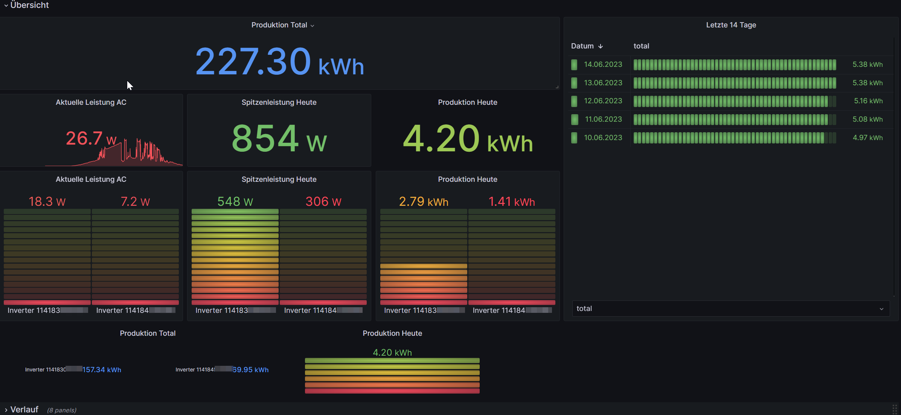
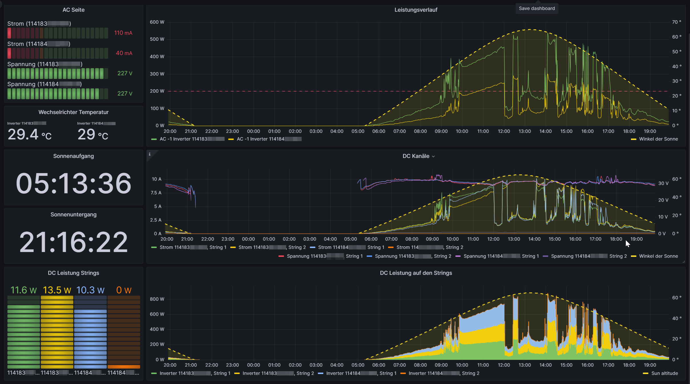

# OpenDTU-MQTT-Telegraf-influxdb-integration

This is a [telegraf](https://docs.influxdata.com/telegraf/v1.27/) configuration which collects data sent by an [OpenDTU](https://github.com/tbnobody/OpenDTU) and imports it into an 
[InfluxDB (Version 2.0)]([https://www.influxdata.com/products/influxdb-overview/).

The idea is to transform the [current structure of MQTT topic](https://github.com/tbnobody/OpenDTU/blob/master/docs/MQTT_Topics.md) sent by the OpenDTU to the format which is compatible with the [future structure of the MQTT topics](https://github.com/tbnobody/OpenDTU/discussions/317#discussioncomment-4345649).

Additionally a [Grafana](https://grafana.com) dashboard is provided using the data in the [InfluxDB](https://docs.influxdata.com/influxdb/v2.7/).

## What you get

Grafana dasboard for your pv system (sunrise / sunset times might not work for you, if you do not import your local weather form the [OpenWeatherMap API](https://openweathermap.org)):

**Overview**


**Details**



And of course the [telegraf](https://docs.influxdata.com/telegraf/v1.27/) configuration to import the data from a MQTT server into [Inflxdb V2].

## How to use it

### Prerequisites

Quite some prerequisites need to be fulfilled. Just check the linked pages, is you not already have these:

1. [OpenDTU](https://github.com/tbnobody/OpenDTU) set up and running
2. A MQTT server (e.g. [Mosquitto](https://mosquitto.org)) up and running
3. [Grafana](https://grafana.com) installed
4. [Docker engine](https://docs.docker.com/engine/install/) and the [Docker compose plugin](https://docs.docker.com/compose/install/) installed 

### MQTT configuration

Create a user / password on your MQTT server which is entitled to read the OpenDTO topics (`/solar/#` if you left the defaults. )

### InfluxDB configuration

Go to your influxdb web frontend and:
- create a bucket called `solar/actual`
- create an API token, which is permitted to write to this bucket

### Setup and run Telegraf importer

- Adjust configurtion
  Copy the file `telegraf-settings.env.example` to `telegraf-settings.env` and edit it to fit your local setup. I.e.insert MQTT username/ password and InfluxDb API token.

- Run using docker compose
  Check `docker-compose.yml` and adapt to your needs and run it with:
  ```bash
  docker-compose up -d
  ```

### Grafana dashboard

- Create an InfluxDB datasource if you not already have it,
- import the dashboard from `grafana/solar.yml`,
- connect it to your Influx datasource `solar/actual`, and
- edit the template variables of the imported dashboard (for sun altitude and sunrise/sunset)
